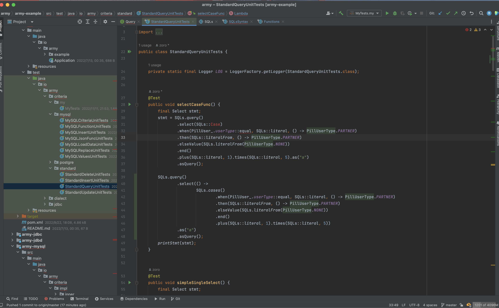

1. 为什么不支持 sub query insert?
    1. 不能保证 child domain 的 id, parent DiscriminatorValue 和 有创建器的字段进行控制,
    2. application developer 容易犯错.
    3. 相关的功能可以用先查再插入的方式来代替.

2. 为什么 io.army.criteria.Expression 以 Function 为参数的方法都没有 ifXxx 方法?
    * ifXxx 的方法都是配合 statement api 的 ifAnd 方法 ,所以如果要用 function 则直接用 statement api 的 ifAnd 方法即可.

3. 为什么 batch update / delete 不支持 Collection 全名参数?
    * 因为 集合的的元素不确定,无法生成固定数量的 占位符 '?'

4. 为什么所有 非 batch update 都只有 ifSet(List&lt; FieldMeta&lt; ?,?> fieldList,List&lt; Expression> valueList); 而没有 ifSet(
   Function&lt; List&lt;
   FieldMeta&lt; ?,?>> fieldList,Function&lt; List&lt; Expression>> valueList)?
    * 因为 set 子句必须一一对应而,而 有 Function 的 ifSet 方法对 field 和 value 放在两方法中 很难一一对应.
    * 两个参数都是 List 可以通过 for 循环保证 一一对应.

5. 为什么不提供一个 SQLs.optimizingParam() 方法?
    * 因为多余,如果需要这个一个方法还不如直接调用 SQLs.literal() 方法.

6. 为什么不在 语法 api 的 where 子句 提供 or 子句 而只提供 and 子句?
    * 因为输出的 sql 不会有不必要的括号,hibernate 就提供了 or 子句,输出的 sql 才会 那么多不必要的括号.
    * 因为这样设计可以把整个框架的结构变简单,比如 追加 visible 列时总是有效且不会出错.
    * or 子句只能在 io.army.criteria.IPredicate 提供,这样可以保证 or 子句始终被括号包裹成一个整体.

7. 为什么 io.army.criteria.Expression 总要多设计一个 equalLiteral(Object ) 方法 , equal(Object ) 不够用吗?
    * equalLiteral(Object ) 输出的是 字面量,equal(Object ) 输出的占位符 '?' ,army 不认为在任何场景下 application
      开发者都想输出占位符.
    * 从 sql style 的视角,既能输出 '?' 也能输出字面量才够 sql style.
    * 从 driver 的角度 没有字符串这个能产生 sql 注入的类型的场景中,没有 '?' 执行的是 database 的文本协议而不是 prepare 协议,在一部分场景来说是更快的, 尤其是网络效率高.
    * 从jdbc 多语句的角度考虑,没有 '?' 你才能使用多语句的 jdbc api,当然如果使用的是 jdbd 则不关心这个问题.

8. 为什么 io.army.criteria.Expression 总有一个 equalNamed(String) 方法,这个做什么的?
    * 这个方法是为批量 dml 语句设计的,这个方法能把批量语句的 代码变得简洁.
    * io.army.criteria.TableField 的 equalNamed() 也是同理.

9. 为什么 不支持 application 开发者重写 默认 mapping type?
    * army 的默认 mapping 已经足够满足大多数场景.
    * army 的默认 mapping 是内置实现,相对安全.
    * 如果支持重写默认 mapping ,会给新入开发团队的的开发者造成认知混乱,对于项目管理和每一位开发者来说都是不利的.

10. 为什么 io.army.criteria.impl.JoinableUpdate0 不能持有 CriteriaContext ?
    * NestedItems 不能持有 CriteriaContext,只能持有 List

11. 什么是 SQL style 的神(这里的神是形神兼备的神)?
    * sql style 不是 sql 本身
    * sql style 是 sql 子句的有序组合
    * sql style 是弱类型的,为什么敢于是弱类型,因为:
        * sql 是弱类型
        * java 是强类型语言,已经提供了一定程度类型安全
        * 如果你使用 Map 作为 criteria 对象,那么你已经选择放弃类型安全,不是吗?
    * sql style 追求代码的整体性,即不被 if 或 for 分割
    * sql style 追求更高的可读性
    * sql style 追求明确的语义,因此 batch update 和 update 分别由不同的方法提供.

12. 为什么 with clause 实现没有设计成 顶层 基类?
    * with clause 实现需要 CriteriaContext
    * NestedItems 没有 CriteriaContext

13. 为什么 io.army.criteria.Expression 要设计 ifEqual(Supplier&lt; Object>) 和 ifEqual(Function&lt; String, Object> function,
    String
    keyName) 方法, 而放弃 ifEqual(@Nullable Object) 方法?
    * 首先在一部分场景 ifEqual(@Nullable Object) 确实能替换两者,似乎理方便,但 ifEqual(@Nullable Object) 参数是 Object, 而我们总是得设计 一个 ifEqual(
      Function&lt; C,Object>) 方法,大多数情况下java 都能识别这两个方法,但谨慎的原则考虑还是要避免重载 Object 参数的方法.
    * 在别一部分场景里 我们不能直接使用 java bean 的 getXxx() 方法和 Map.get(String) 方法得到条件,而是需要一些简单的计算,在这个场景里 ifEqual(@Nullable Object)通过 在
      语句的 之前准备好条件或者定义一个新方法,可 Supplier 可依赖于 lambda 和方法引用, 两者虽可替换,但从 sql style 和 代码相关性而言,lambda 和 方法引用 更胜一筹.
    * equalExp(Function&lt; C, Expression>) 和 equalExp(Supplier) 方法其实也是为避免重载 equal(Object) 方法.其它操作符同理.

14. 为什么 Criteria api 不再提供 List&lt;T>, Supplier&lt;List&lt;T>> 和 Function&lt;List&lt;T>> 而是提供 Consumer&lt;Consumer&lt;
    T>>
    和 BiConsumer&lt;C,Consumer&lt; T>> ?
    * 保证运行时 ThreadLocal 的 CriteriaContext 是当前的
    * 保证运行时 SQLs.ref(derivedTable,fieldName) 能正确运行

15. 为什么提供 SQL 函数的的静态方法使用 Expression 参数 而不使用 Object 参数?
    * 使用 Expression 方便扩展重载

16. 为什么 Postgre insert 不支持 DEFAULT VALUES 子句?
    * 因为 army 管理 createTime ,updateTime,Generator field 等 field.

17. 为什么 standard insert parent 部分要预留 CT 类型变量?
    * 因为 standard 将来要支持 with cte 子句.

18. 为什么 with 子句 的 CTE 创建没有采用常规的 static 方法而采用了构造器?
    * 常规的静态方法在实现层面总是对 CTE 有外部上下文存疑.
    * 由于确定了 CTE 的外部上下文能更好的实现 RECURSIVE 引用.

19. 为什么 static with clause 只能出现在 primary statement api 中?
    * 如果 sub statement 出现 static with clause 将影响整个 sql api 代码的可读性,这违背了 army 的价值观

20. 为什么 删除 SQLs.namedParam(DataField),SQlLs.namedNullableParam(DataField),SQlLs.namedLiteral(DataField)
    ,SQlLs.namedNullableLiteral(DataField) method?
    * 因为 加上 set(F field,Function) 和 set(F field,BiFunction) 后, jvm 无法准确识别,容易出问题.

21. 为什么 where 子句 and 子句 set 子句要设计那么多的，那么长的 函数接口参数?
    * 因为只这样设计成函数类型的参数能才能将程序行为更好的组合.
    * 能消除方法的圆括号,使代码更简洁

22. 为什么设计 io.army.criteria.Item ？
    * 它代表 army 内部可能通过 sql 语法 api 隧道传递的任何东西
    * 有了这样的设计 army 可以支持静态的复杂子句,这样的方式使得 army 写出的代码深度浅,更简洁、更可读、更自由.

23. 为什么要舍弃 静态 cte 的space 子句和 union 之后的 space 子句(它们可能组合优于继承)?
    * 因为静态 cte 的复合命令必须重复实现 query 的 select 子句和 with 子句,既如此,不如舍弃 cte 的space 子句和 union 之后的
      space 子句
    * 舍弃之后,语法上更 SQL style

24. 为什么要 删除 WA where(BiFunction&lt;TeNamedOperator&lt;DataField>, Integer, IPredicate> expOperator,
    TeNamedOperator&lt;DataField> namedOperator, int size) ?
    * 因为 jvm 不能推先推断出 TeNamedOperator 和 BiFunction&lt;Expression, T, Expression> valueOperator 的差别.
      method equal in interface io.army.criteria.Expression cannot be applied to given types
      required: java.util.function.BiFunction&lt;io.army.criteria.Expression,T,io.army.criteria.Expression>,T
      found: io.army.function.TeNamedOperator&lt;io.army.criteria.SQLField>,java.lang.Integer
      reason: cannot infer type-variable(s) T
      (argument mismatch; io.army.function.TeNamedOperator&lt;io.army.criteria.SQLField> cannot be converted to
      java.util.function.BiFunction&lt;io.army.criteria.Expression,T,io.army.criteria.Expression>)

25. 为什么 INSERT 语句中的 defaultValue 子句保留 T value 相关方法而删除 Supplier getter 相关方法 ? 这与其它语句的取舍不同.
    * 因为 defaultValue 子句的场景更多的来源于 简单值而不是 pojo.

26. 为什么一定要支持 AliasExpression 和 复杂 sql function 引用 ?
    * 见图 
    * 所以下定决心一定要支持

27. 为什么表态 with clause 以 space 子句结束？
    * 因为 select 子句的 SQLs.field() 方法和 SQLs.refThis() 方法需要真实的 query context.

28. 为什么 实现类不能同时实现 Insert 和 ReturningInsert?
    * 因为 session api 上要能正确区分这两种类型,在这点上要保证类型安全,否则无法返回正确结果.Update 与
      ReturningUpdate,Delete 与
      ReturningDelete 同上。
29. 为什么创建 Bracket 只需要一个 ArmyStmtSpec?
    * 根据最新的结构设计创建 Bracket 一定需要 WITH 子句和 context 的迁移.

30. 为什么 io.army.criteria.Query._DynamicParensRowSetClause 不能提供 parens(RowSet) 方法?
    * 因为一旦抛出异常就会污染 context stack.

31. 为什么 CteItem 和 _AliasDerivedBlock 不被设计成 DerivedTable?
    * 因为它们本质上不是,它们拥有 名字 和对 selection 重命名的能力,_AliasDerivedBlock 还有 javaType和 on 子句.
    * 但 postgre 要特别处理,因为 postgre cte 可通过 search 和 cycle 子句追加附加字段

32. 为什操作符的右操作数若不是简单表达式就会给右操作数追加外部括号,呈现一种管右不管左的特征?
    * SQL style 要模仿 sql 所以左操作数不加外部括号(左操作数总是 this) .
    * 由于右操作数是通过方法参数传入的,在理念上是一个整体,所以若不是简单表达式则要为右操作数追加外部括号.
    * SQL style 要与编程语言特性相结合.

33. 为什么要设计 io.army.criteria.SimpleExpression ?
    * 因为 由于操作符的优先级等原因难以确定 funcRef 的 左操作数.
    * 将 所有支持 funcRef 的方法迁移到 io.army.criteria.SimpleExpression 可以避免问题
    * 这是典型的以结构避免问题

34. 为什么设计 io.army.criteria.SimplePredicate ?
    * 仅强调 OR 和 XOR 操作符产生的 IPredicate 一定有 外部括号
    * 这个设计是对 第 6 条的完善和补充
    * 避免 sql function return expression type bug

35. 为什么设计 SQLs.encodingParam(TypeInfer, Object) 等方法?
    * 因为 codec field 作为参数类型时具有加密参数这样的特殊含义,语义必须明确，不能暗含，否则将造成不
      可挽回的数据灾难.
36. 为什么 Tabular function 不能有 context ?
    * 因为不像语句有明确的开始和结束时间
    * push 到 stack 容易,但却没有 pop 的时机
    * SQL.refOut() 应用困难,因为引用发生在 context 创建之前.
37. 为什么 DerivedField typeMeta() 不能返回 io.army.meta.TypeMeta.DelayTypeMeta ?
    * 因为 这会影响 codec field 的解码
38. 为什么要设计 io.army.criteria.CompoundExpression 和 io.army.criteria.CompoundPredicate ?
    * 为了 io.army.criteria.Expression.apply() 和 io.army.criteria.Expression.test() 的调用是类型安全的.

39. 为什么设计 io.army.criteria.TypeInfer.DelayTypeInfer 而不直接使用 io.army.meta.TypeMeta.DelayTypeMeta ?
    * 因为 io.army.meta.TypeMeta.DelayTypeMeta 会导致 来自于 子查询的 codec field 无法解码

40. 为什么 删除了 io.army.criteria.TypeInfer.DelayTypeInfer ?
    * 因为 所有 delay 根源都是 io.army.criteria.impl.SQLs.refThis() 和 io.army.criteria.impl.SQLs.refOut(),
      选择用 select clause 异步调用来解决执行顺序问题是更好的选择.
    * 这是一个重要经验,从根源上解决总是也是一种 mapping real word.

41. 为什么要删除原有的 batch update api,而选择在 simple update 结尾加上 nameParam 子句?
    * 因为原有的 api 需要定义两套 接口
    * 新增 批量查询 api 如果也定义两套 api 那将是一场灾难
42. 为什么 one-statement child insert default id expression 是开发者自己写?
    * 这个情况 army parser 比较难实现
    * SQL 整体的可读性更好.
    * parent sub-insert rowNumber CTE 同理
43. 为什么 firebird 和 h2 的子表一更新不支持 IN 操作符指定 id?
    * 因为由于过滤条件的原因实际更新行数可能小于 IN 操作符的右操作数
44. 为什么 sub query 不用 leftParen 开始 rightParen 结束?
    * 因为要和 primary query 使用同一套 接口,这是由于 java 不能支持像 go 一样的组合造成的

